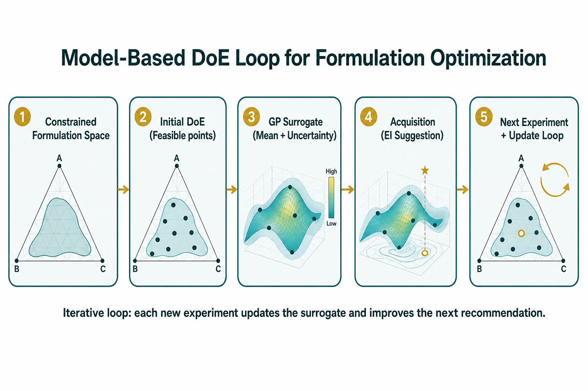
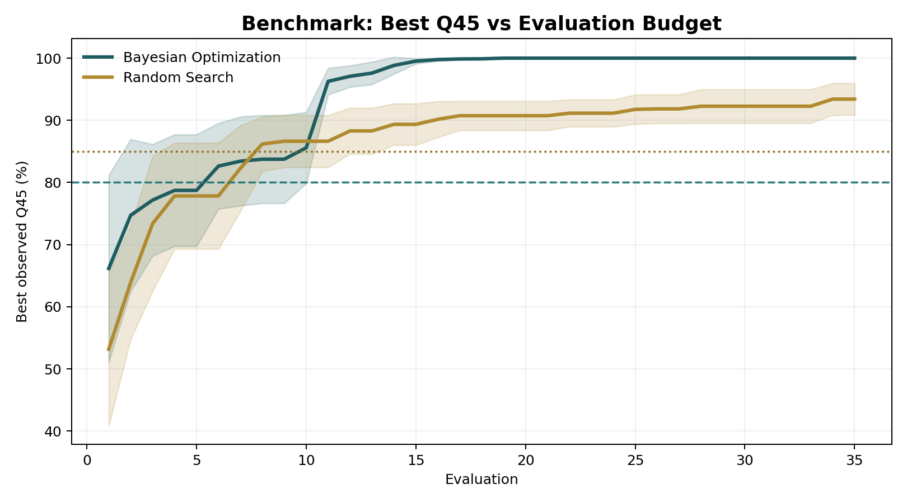

# Bayesian Optimization for pharmaceutical tablet formulation

## Problem statement
Tablet formulation development is expensive because each wet-lab experiment consumes time and material.  
With interacting excipients and hard constraints (mass balance + bounds), naive screening methods like OFAT or brute-force grids waste runs and miss high-performing regions.

This project answers one core question:
**How do we find good formulations faster, with fewer experiments, under realistic formulation constraints?**

### Explainer (60-second animated overview)


<video src="bo_explainer.mp4" controls width="960"></video>


## What is Q45?
`Q45` is the **percentage of drug dissolved at 45 minutes** (0-100%).  
In general form:

\[
Q45 = 100 \times \frac{\text{drug dissolved at 45 min}}{\text{labeled drug amount}}
\]

In this repo, each experiment returns a Q45 value (from the synthetic simulator), and optimization aims to maximize that value under formulation constraints.

## Visual overview
### Optimization workflow


### Headline benchmark result



## Our solution
We use a **model-based DoE loop with Bayesian Optimization (BO)**:
1. Fit a probabilistic surrogate (Gaussian Process) on observed formulation outcomes.
2. Quantify uncertainty over unexplored regions.
3. Select the next experiment using an acquisition function (Expected Improvement).
4. Update the model with the new result and repeat.

In short: we replace blind search with uncertainty-aware sequential experimentation.

## Formulation context
- Fixed API: `30% w/w`
- Excipients sum to `70% w/w` with bounds:
  - `HPMC`: `0-20%`
  - `MCC`: `20-60%`
  - `CCS`: `1-8%`
  - `MgSt`: `0.25-2%`
  - `PVP K30`: derived by mass balance, constrained to `0-10%`
- Primary objective: maximize `Q45` (dissolution at 45 min)

## How we solve it in this repo
### 1) Baseline DoE (why naive design is insufficient)
- `notebooks/01_doe_baseline.ipynb`
- Shows factorial feasibility collapse under constraints, then constrained D-opt proxy + CCD-style baseline, then quadratic RSM.

### 2) Core BO loop
- `notebooks/02_bayesian_optimization.ipynb`
- Runs BO end-to-end (init design + sequential suggestions), with convergence, posterior, and acquisition plots.

### 3) Benchmark vs alternatives
- `notebooks/03_comparison.ipynb`
- Compares BO against random/grid/RSM-guided search under equal evaluation budget.

### 4) Interactive app for scientists
- `app/streamlit_app.py`
- Explore design space, run one-step BO suggestions, log experiments, view convergence, and compare strategies.

## Quick start
```bash
python -m venv .venv
source .venv/bin/activate
pip install -r requirements.txt
```

Run notebooks:
```bash
jupyter lab
```

Run app:
```bash
streamlit run app/streamlit_app.py
```

## Why this matters (CMC/QbD relevance)
- Maps directly to **model-based DoE** under constraints.
- Uses GP uncertainty for **design space characterization**.
- Prioritizes runs via acquisition for **systematic experiment planning**.
- Supports multi-CQA trade-offs via Pareto fronts.

## Assumptions and limitations
- Uses a physics-informed synthetic simulator (not proprietary lab data).
- Adds Gaussian observation noise to mimic experimental variability.
- Demonstrates method on a 5-variable space; real programs may include more CQAs/process factors/categorical variables.
